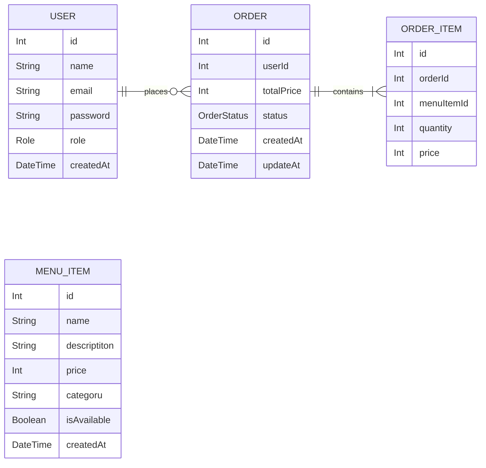

# Food Ordering System - Architecture Document

## 1. Project Overview

This project is a backend REST API for a food ordering system.

The system supports two roles:

- User
- Restaurant Admin

Users can browse the menu and place orders.

Admins can manage menu items and order statuses.

---

## 2. Project Goals

- Implement RESTful APIs
- Implement JWT Authentication
- Implement Role-Based Authorization
- Design Relational Database
- Apply Business Rules
- Handle Errors Properly
- Dockerize the project
- Document APIs using OpenAPI
- **Optional**
  - Unit test
  - CICD if i can

---

## 3. System Actors

### User

Permissions:

- Register
- Login
- View Menu
- Create Order
- View Own Orders

### Admin

Permissions:

- View Menu
- View All Orders
- Create Menu Item
- Update Menu Item
- Delete Menu Item
- Update Order Status

---

## 4. Technology Stack

Backend:

- Node.js
- Express.js

Database:

- PostgreSQL

ORM:

- Prisma

Authentication:

- JWT
- bcrypt

Validation:

- Zod

Environment Variables:

- dotenv

Tools:

- nodemon

---

## 5. Project Architecture

```diagram
Client
↓
Express Routes
↓
Controllers
↓
Services
↓
Prisma ORM
↓
PostgreSQL
```

Responsibilities:

Routes:
Receive HTTP requests

Controllers:
Handle request and response

Services:
Business logic

Prisma:
Database access

Database:
Persistent storage

---

## 6. Folder Structure

```diagram
src/
├── routes/
│   ├── auth.routes.js
│   ├── menu.routes.js
│   └── order.routes.js
│
├── controllers/
│   ├── auth.controller.js
│   ├── menu.controller.js
│   └── order.controller.js
│
├── services/
│   ├── auth.service.js
│   ├── menu.service.js
│   └── order.service.js
│
├── middlewares/
│   ├── auth.middleware.js
│   ├── role.middleware.js
│   └── error.middleware.js
│
├── validators/
│
├── prisma/
│
├── utils/
│
├── app.js
└── server.js -> if we have testing approach otherwise ignore
```

---

## 7. Database Entities

```
users
─────────────────
id
name
email
password
role         (user / admin)
created_at

menu_items
─────────────────
id
name
description
price
category     (غذای اصلی / پیش‌غذا / نوشیدنی / دسر)
is_available (true / false)


orders
─────────────────
id
user_id      (foreign key → users)
total_price
status       (pending / confirmed / preparing / delivered / cancelled)
created_at
updated_at

order_items
─────────────────
id
order_id     (foreign key → orders)
menu_item_id (foreign key → menu_items)
quantity
price
```



---

## 8. API Endpoints

Authentication

```shell
POST /auth/register
POST /auth/login

#Menu

GET /menu
GET /menu/:id
POST /menu
PUT /menu/:id
DELETE /menu/:id

#Orders

POST /orders
GET /orders (admin -> all orders), (user -> own orders)
GET /orders/:id
PATCH /orders/:id
```

---

## 9. Business Rules

BR-01

Only **available** menu items can be ordered.

BR-02

**Total price** must be calculated by the **server**.

BR-03

Users can only view their **own orders**.

BR-04

Only **admins** can update order status.

BR-05

Quantity must be greater than zero. -> **0 > quanitty**

---

## 10. Git Workflow

Main Branch:

main

Feature Branch Naming:

feature/auth-register

feature/auth-login

feature/menu-crud

feature/order-management

Bug Fix Naming like:

fix/order-validation

fix/auth-token

---

## 11. Development Milestones

M1 - Planning

M2 - Project Setup

M3 - Database Design

M4 - Authentication

M5 - Menu Management

M6 - Order Management

M7 - Validation & Error Handling

M8 - Documentation & Final Review